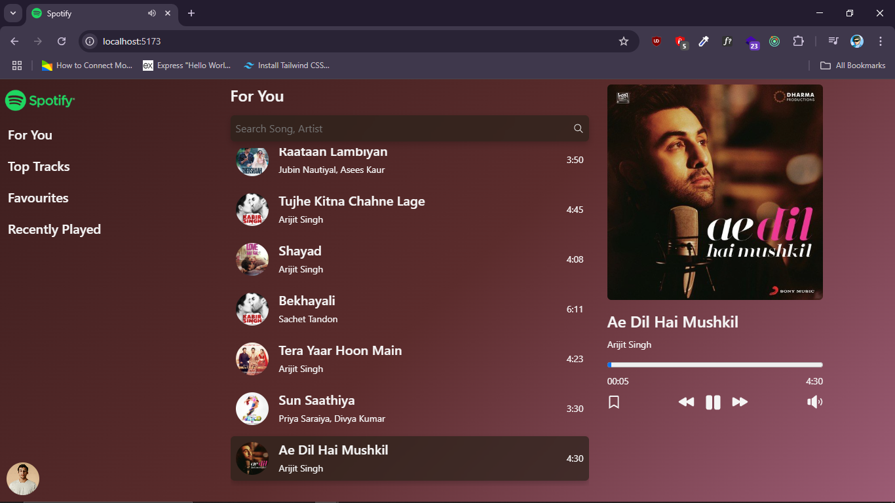

# 🎵 Music Player App

A modern and elegant music player built with React that plays your favorite tracks with stylish UI, real-time toast notifications, and dynamic gradient backgrounds that adapt to the song's theme.


## 🔥 Features

- 🎧 Play/Pause music
- ⏭ Next/Previous song
- 📀 Song list with thumbnails and info
- ❤️ Add/Remove songs from favorites
- 🎨 Dynamic background gradients based on songs
- 🔊 Custom audio player with full controls
- 📱 Fully responsive and mobile-friendly
- ⚡ Toast notifications using `react-hot-toast`

## 🛠️ Tech Stack

- **Frontend:** ReactJS, TailwindCSS
- **Icons:** FontAwesome / Custom SVGs
- **Notifications:** react-hot-toast
- **Styling:** CSS gradients, transitions

## 🖼️ Screenshot



## 🚀 Getting Started

### 1. Clone the repo
```bash
git clone https://github.com/ankitjhagithub21/spotify.git
cd spotify
npm install
npm run dev

